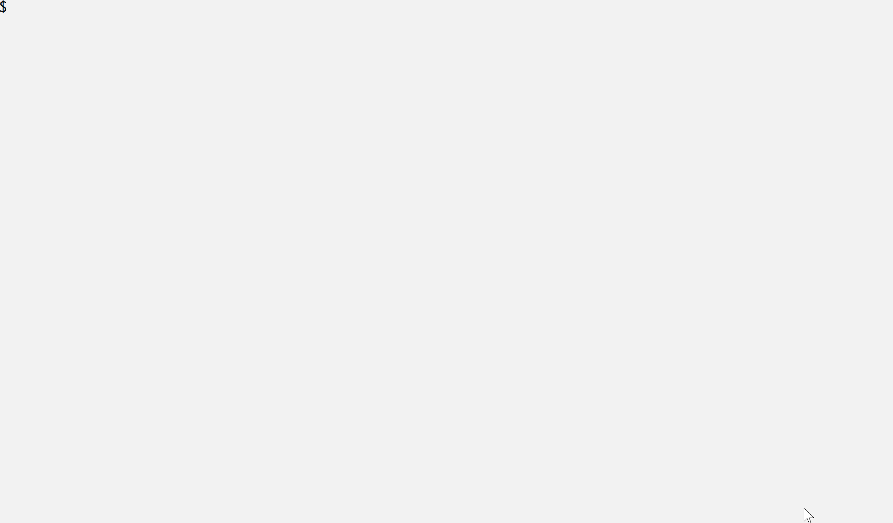

# word-guess-node-app

## Description

 A simple implementation of the Word Guess Game as a command line Node.js application.

## How to get started

Requires `Node.js`. Clone the repository to a local folder and install the dependencies with `npm install`.

## Gameplay

Start the game with `node game.js` and follow the on-screen instructions. An example of a typical gameplay is shown below.

